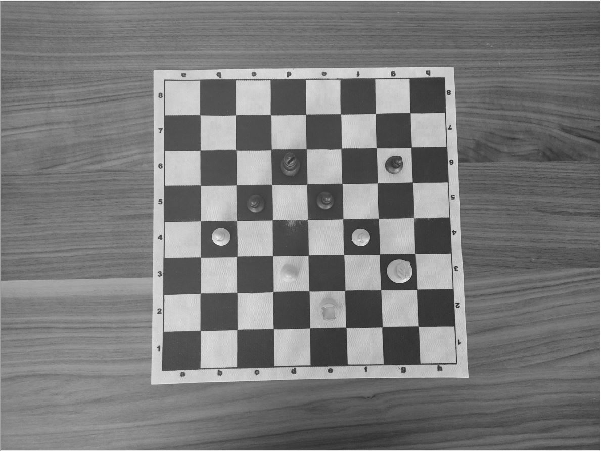

# ChessBoardPieceLocation
  Gebze Technical University Image processing course project.The project was created by 2 people.

   
   
# Abstract
It is a project that involves defining the chessboard from an image. The algorithm for defining the chessboard is based on locating the pieces on the board by uploading the 
currently rendered image of the user's chessboard. The algorithm is an application that can recognize the board, detect the squares on it, and locate the stones with an average 
percentage. The algorithm has been created using basic image processing techniques. This chessboard identification algorithm works for viewing angles between 80-90 degrees. It 
does not detect chess pieces and their colors. It is a project created on the idea of transferring the board watched by the camera from the beginning of the game to the 
application according to the location.

# Usage
- Change the name of the board you want to test in 'main.m' file.
- Run 'main.m' to implement the populated chessboard recognition recognition.

# Citation
If you use our method and/or codes, please cite our paper

